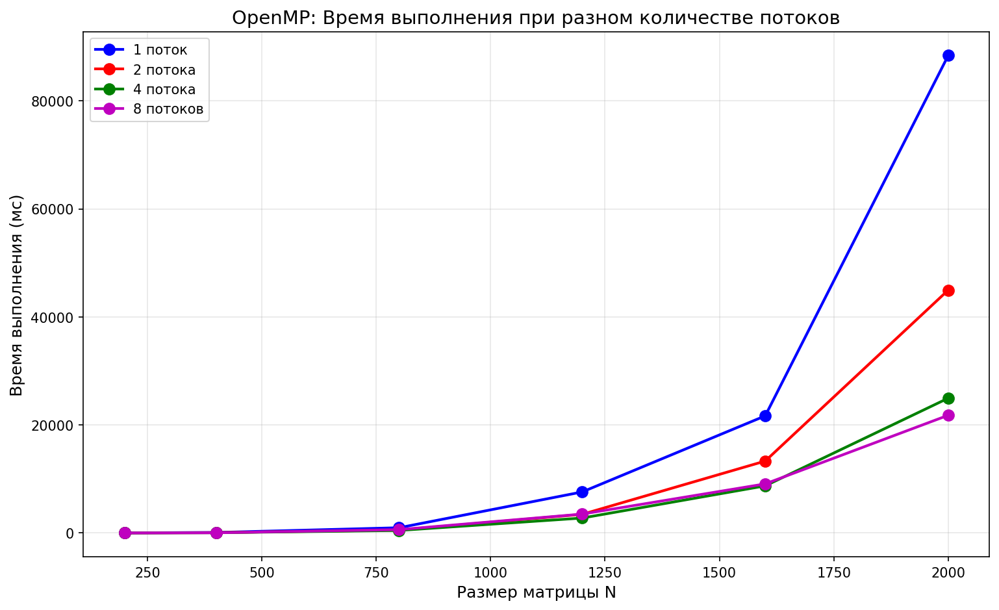
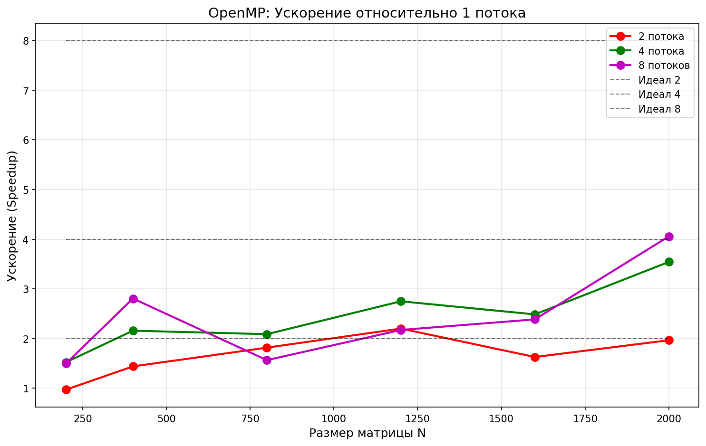
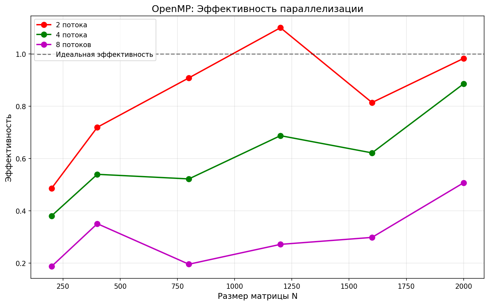
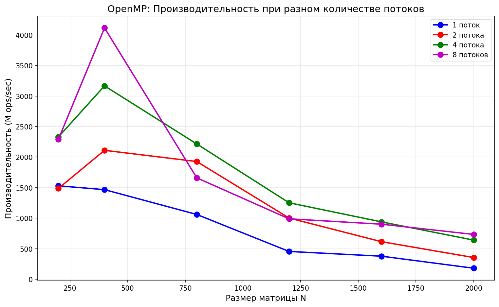

# Лабораторная работа №2: Параллельное перемножение квадратных матриц с использованием OpenMP

**Студент:** Барнаева Марина  
**Группа:** 6311-100503D 
---

## Что было сделано

В рамках лабораторной работы была модифицирована программа из ЛР №1 для параллельной работы по технологии OpenMP.

**Реализовано:**
- чтение двух квадратных матриц из файлов;
- параллельное перемножение матриц с использованием OpenMP;
- измерение времени выполнения для разного количества потоков;
- сохранение результирующей матрицы в файл;
- автоматическая верификация результатов через Python + NumPy.

**Проведены эксперименты:**
- размеры матриц: 200, 400, 800, 1200, 1600, 2000;
- количество потоков: 1, 2, 4, 8.

---

## Структура проекта

pp_lab/
├── lab2_omp.cpp # Основная программа на C++ с OpenMP
├── lab2_omp.exe # Скомпилированная программа
├── lab2_plot.py # Python скрипт (генерация, запуск, верификация)
├── draw_graph_omp.py # Скрипт для построения графиков
├── results_omp.csv # Таблица результатов
├── omp_time.png # График времени выполнения
├── omp_speedup.png # График ускорения
├── omp_efficiency.png # График эффективности
├── omp_performance.png # График производительности
└── README.md # Данный файл

---

## Результаты экспериментов

### Таблица 1: Время выполнения (мс)

| Размер N | 1 поток | 2 потока | 4 потока | 8 потоков |
|----------|---------|----------|----------|-----------|
| 200      | 10.457  | 10.764   | 6.869    | 6.986     |
| 400      | 87.268  | 60.636   | 40.430   | 31.105    |
| 800      | 965.525 | 531.369  | 462.391  | 616.824   |
| 1200     | 7590.292| 3448.671 | 2760.161 | 3493.070  |
| 1600     | 21675.854| 13310.825| 8717.355 | 9084.148  |
| 2000     | 88412.669| 44971.032| 24955.860| 21791.660 |

### Таблица 2: Ускорение (Speedup)

| Размер N | 2 потока | 4 потока | 8 потоков |
|----------|----------|----------|-----------|
| 200      | 0.97     | 1.52     | 1.50      |
| 400      | 1.44     | 2.16     | 2.81      |
| 800      | 1.82     | 2.09     | 1.57      |
| 1200     | 2.20     | 2.75     | 2.17      |
| 1600     | 1.63     | 2.49     | 2.39      |
| 2000     | 1.97     | 3.54     | 4.06      |

### Таблица 3: Производительность (M ops/sec)

| Размер N | 1 поток | 2 потока | 4 потока | 8 потоков |
|----------|---------|----------|----------|-----------|
| 200      | 1530.12 | 1486.45  | 2329.34  | 2290.30   |
| 400      | 1466.75 | 2110.97  | 3165.99  | 4115.07   |
| 800      | 1060.56 | 1927.10  | 2214.58  | 1660.12   |
| 1200     | 455.32  | 1002.13  | 1252.10  | 989.39    |
| 1600     | 377.93  | 615.44   | 939.74   | 901.79    |
| 2000     | 180.97  | 355.79   | 641.13   | 734.23    |

---

## Графики

### График 1: Время выполнения

### График 2: Ускорение

### График 3: Эффективность

### График 4: Производительность

---

## Выводы

В ходе выполнения лабораторной работы №2:

1. **Реализована параллельная версия** программы умножения матриц с использованием технологии OpenMP.

2. **Проведены эксперименты** для матриц размером от 200 до 2000 с разным количеством потоков (1, 2, 4, 8). Все результаты успешно прошли верификацию.

3. **Подтверждена эффективность параллелизации**:
   - Максимальное ускорение достигнуто на матрице 2000×2000 при использовании 8 потоков и составило **4.06x**;
   - Производительность выросла с 181 M ops/sec (1 поток) до 734 M ops/sec (8 потоков).

4. **Выявлены особенности**:
   - Для маленьких матриц (N=200) накладные расходы на создание потоков превышают выигрыш от параллелизации;
   - Наибольшая эффективность наблюдается на больших матрицах (N=2000), где вычислений достаточно много.

5. **Верификация** через NumPy подтвердила корректность всех вычислений (PASSED для всех размеров и потоков).

