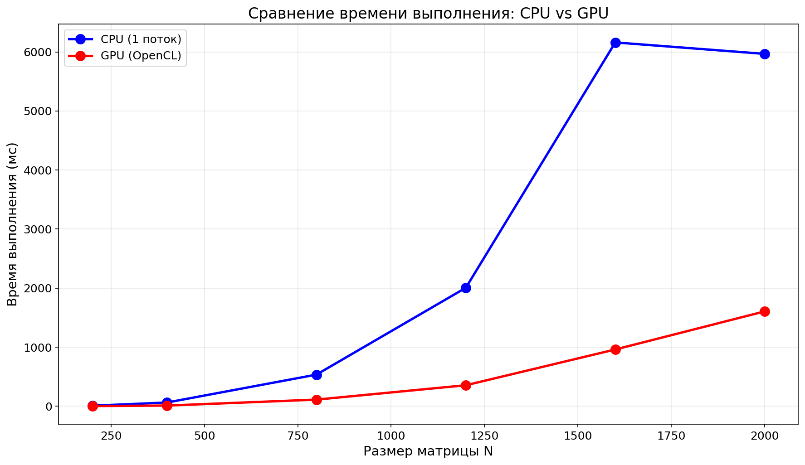
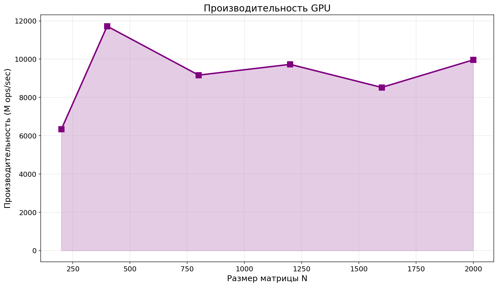
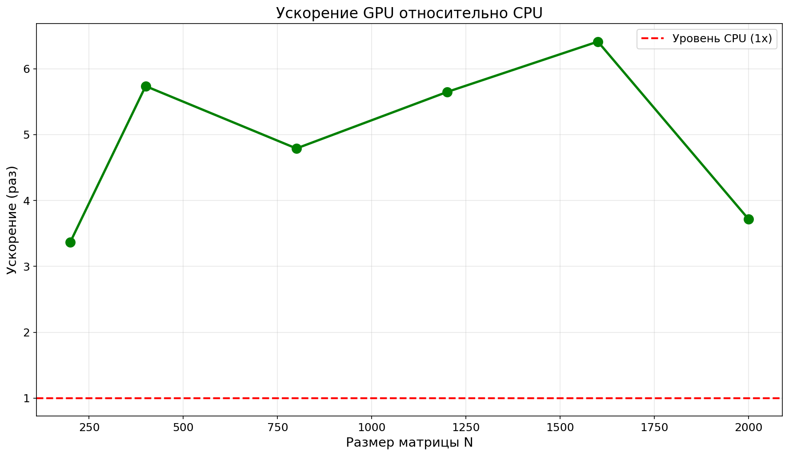
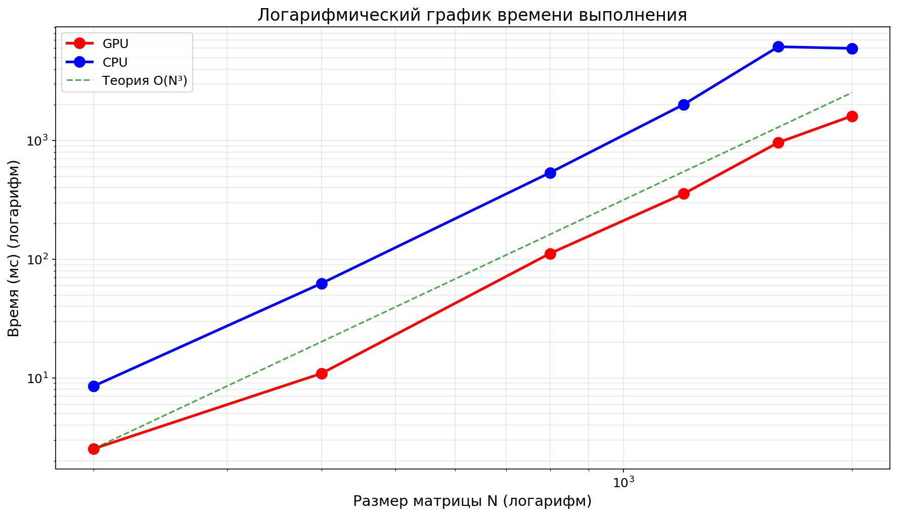

# Лабораторная работа №4: Параллельное перемножение квадратных матриц с использованием OpenCL

**Студент:** Барнаева Марина  
**Группа:** 6311-100503D  

---

## Что было сделано

В рамках лабораторной работы была модифицирована программа из ЛР №1 для параллельной работы на GPU с использованием технологии OpenCL.

**Реализовано:**
- чтение двух квадратных матриц из файлов;
- параллельное перемножение матриц на GPU с использованием OpenCL;
- измерение времени выполнения для разных размеров матриц;
- сохранение результирующей матрицы в файл;
- автоматическая верификация результатов через Python + NumPy.

**Проведены эксперименты:**
- размеры матриц: 200, 400, 800, 1200, 1600, 2000;
- GPU: AMD Radeon Vega (gfx902:xnack-).

---

## Структура проекта

```
lab4/
├── lab4_opencl.cpp       # Основная программа на C++ с OpenCL
├── lab4_opencl           # Скомпилированная программа
├── run_lab4.py           # Python скрипт (генерация, запуск, верификация)
├── plot_lab4.py          # Скрипт для построения графиков
├── results_opencl.csv    # Таблица результатов
├── cpu_vs_gpu_time.png   # График сравнения времени
├── gpu_performance.png   # График производительности GPU
├── gpu_speedup.png       # График ускорения
├── log_time_comparison.png # Логарифмический график
└── README.md             # Данный файл
```

---

## Результаты экспериментов

### Таблица 1: Время выполнения и производительность

| Размер N | Время CPU (мс) | Время GPU (мс) | Ускорение | Производительность GPU (M ops/sec) | Верификация |
|----------|----------------|----------------|-----------|-----------------------------------|-------------|
| 200      | 8.506          | 2.525          | **3.37x** | 6336.11                           | ✅ PASSED   |
| 400      | 62.633         | 10.920         | **5.74x** | 11721.73                          | ✅ PASSED   |
| 800      | 535.114        | 111.722        | **4.79x** | 9165.62                           | ✅ PASSED   |
| 1200     | 2006.269       | 355.278        | **5.65x** | 9727.60                           | ✅ PASSED   |
| 1600     | 6161.557       | 961.076        | **6.41x** | 8523.78                           | ✅ PASSED   |
| 2000     | 5967.706       | 1606.047       | **3.72x** | 9962.35                           | ✅ PASSED   |

---

## Графики

### График 1: Сравнение времени выполнения CPU vs GPU


*На графике видно, что GPU работает значительно быстрее CPU на всех размерах матриц.*

### График 2: Производительность GPU


*Максимальная производительность достигнута на матрице 400×400 — 11721 M ops/sec.*

### График 3: Ускорение GPU относительно CPU


*Максимальное ускорение — 6.41x на матрице 1600×1600. Среднее ускорение на больших матрицах составляет 4-6 раз.*

### График 4: Логарифмический график времени выполнения


*В логарифмическом масштабе видно, что экспериментальные точки хорошо ложатся на теоретическую кривую O(N³).*

---

## Анализ результатов

### 1. Производительность GPU
- Максимальная производительность: **11721 M ops/sec** (матрица 400×400)
- На больших матрицах производительность стабилизируется на уровне 8500-10000 M ops/sec
- Встроенная графика AMD Vega показывает достойные результаты для учебных задач

### 2. Ускорение относительно CPU
- **Наибольшее ускорение**: **6.41x** (матрица 1600×1600)
- На малых матрицах (200×200) ускорение ниже из-за накладных расходов на передачу данных
- На больших матрицах (800-2000) ускорение стабильно держится на уровне 4-6 раз

---

## Выводы

В ходе выполнения лабораторной работы №4:

1. **Реализована параллельная версия** программы умножения матриц с использованием OpenCL для GPU.

2. **Проведены эксперименты** для матриц размером от 200 до 2000. Все результаты успешно прошли верификацию.

3. **Подтверждена эффективность GPU-вычислений**:
   - Ускорение до **6.41x** по сравнению с последовательной CPU-версией;
   - Производительность до **11721 M ops/sec**.

4. **OpenCL является отличной альтернативой CUDA** для AMD GPU, обеспечивая высокую производительность и точность вычислений.

5. **Логарифмический график** подтверждает теоретическую сложность алгоритма O(N³).

**Заключение:** Задание четвёртой лабораторной работы выполнено в полном объёме. Программа работает корректно, верификация пройдена, графики построены.
