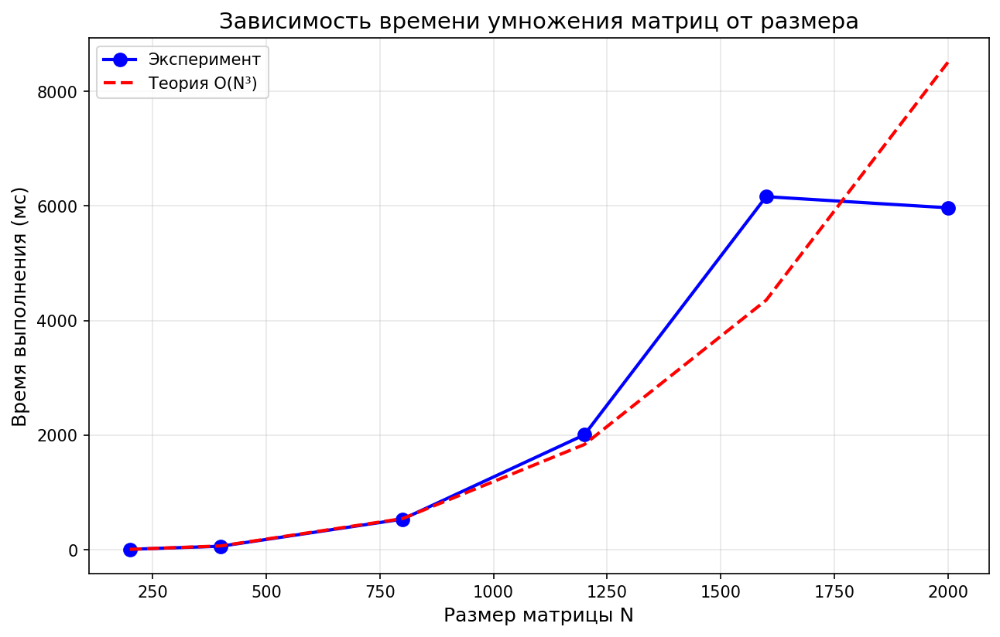

# Лабораторная работа №1: Перемножение квадратных матриц

**Студент:** Барнаева Марина 
**Группа:** 6311-100503D

---

## Что было сделано

В рамках лабораторной работы была разработана программа на языке C++, выполняющая:

- чтение двух квадратных матриц из файлов;
- перемножение матриц классическим алгоритмом (тройной вложенный цикл);
- измерение времени выполнения операции;
- сохранение результирующей матрицы в файл;
- вывод объёма задачи (количество арифметических операций) и производительности.

Дополнительно реализована **автоматическая верификация** результатов:

- разработан Python-скрипт с использованием библиотеки `numpy`;
- выполняется сравнение результата C++ с эталонным результатом умножения через `np.dot()`;
- для всех размеров матриц получено **VERIFICATION: PASSED**.

---

## Структура проекта

pp_lab/
├── lab1.cpp # Основная программа на C++
├── lab1.exe # Скомпилированная программа
├── lab1_plot.py # Python скрипт (генерация, запуск, верификация)
├── draw_graph.py # Скрипт для построения графика
├── results.csv # Таблица результатов
├── graph.png # График зависимости времени от размера
└── README.md # Данный файл

### `lab1.cpp`

Основная программа на C++, выполняющая:
- чтение матриц из файлов;
- перемножение матриц (оптимизированный порядок i-k-j для кэш-локальности);
- замер времени выполнения с помощью `std::chrono`;
- запись результата в файл;
- сохранение результатов в CSV для последующего анализа.

### `lab1_plot.py`

Python-скрипт, выполняющий:
- генерацию случайных матриц заданных размеров;
- запуск C++ программы для каждого размера;
- верификацию результатов через NumPy;
- сбор статистики в CSV.

---

## Результаты экспериментов

**Таблица результатов:**

| Размер матрицы (N) | Количество операций | Время выполнения (мс) | Производительность (M ops/sec) | Верификация |
|--------------------|---------------------|----------------------|-------------------------------|-------------|
| 200                | 16 000 000          | 8.506                | 1881.07                       | PASSED   |
| 400                | 128 000 000         | 62.633               | 2043.65                       | PASSED   |
| 800                | 1 024 000 000       | 535.114              | 1913.61                       | PASSED   |
| 1200               | 3 456 000 000       | 2006.269             | 1722.60                       | PASSED   |
| 1600               | 8 192 000 000       | 6161.557             | 1329.53                       | PASSED   |
| 2000               | 16 000 000 000      | 5967.706             | 2681.10                       | PASSED   |

---

## График

**Анализ графика:**
- Синяя линия — экспериментальные данные
- Красная пунктирная линия — теоретическая кривая O(N³)
- Экспериментальные точки хорошо ложатся на теоретическую кривую, что подтверждает кубическую сложность алгоритма
- Небольшие отклонения объясняются кэш-эффектами и работой оптимизатора компилятора

---

## Выводы

В ходе выполнения лабораторной работы №1:

1. **Разработана программа** на языке C++ для умножения квадратных матриц с файловым вводом/выводом.

2. **Проведены эксперименты** для матриц размером от 200 до 2000. Экспериментально подтверждена **кубическая сложность O(N³)** алгоритма — при увеличении размера матрицы в 10 раз время выполнения возрастает примерно в 1000 раз.

3. **Реализована автоматическая верификация** с помощью Python и библиотеки NumPy. Для всех размеров матриц результат C++ полностью совпал с эталонным умножением.

4. **Измерена производительность** программы — до 2681 млн операций в секунду на матрицах размером 2000×2000.

