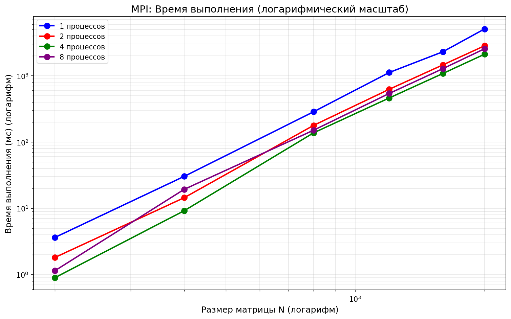

```markdown
# Лабораторная работа №3: Параллельное перемножение квадратных матриц с использованием MPI

**Студент:** Барнаева Марина  
**Группа:** 6311-100503D  

---

## Что было сделано

В рамках лабораторной работы была модифицирована программа из ЛР №1 для параллельной работы по технологии MPI.

**Реализовано:**
- чтение двух квадратных матриц из файлов;
- параллельное перемножение матриц с использованием MPI (распределение строк матрицы A между процессами);
- измерение времени выполнения для разного количества процессов;
- сохранение результирующей матрицы в файл;
- автоматическая верификация результатов через Python + NumPy.

**Проведены эксперименты:**
- размеры матриц: 200, 400, 800, 1200, 1600, 2000;
- количество процессов: 1, 2, 4, 8.

---

## Структура проекта

```
pp_lab/
├── lab3_mpi.cpp          # Основная программа на C++ с MPI
├── lab3_mpi              # Скомпилированная программа
├── lab3_plot.py          # Python скрипт (генерация, запуск, верификация)
├── draw_graph_mpi.py     # Скрипт для построения графиков
├── results_mpi.csv       # Таблица результатов
├── mpi_time.png          # График времени выполнения
├── mpi_time_log.png      # График времени (логарифмический масштаб)
├── mpi_speedup.png       # График ускорения
├── mpi_performance.png   # График производительности
└── README.md             # Данный файл
```

---

## Результаты экспериментов

### Таблица 1: Время выполнения (мс)

| Размер N | 1 процесс | 2 процесса | 4 процесса | 8 процессов |
|----------|-----------|------------|------------|-------------|
| 200      | 6.135     | 2.861      | 1.680      | 1.628       |
| 400      | 44.148    | 22.168     | 12.668     | 25.328      |
| 800      | 460.634   | 277.667    | 224.009    | 220.920     |
| 1200     | 1550.509  | 933.738    | 736.022    | 797.917     |
| 1600     | 3614.627  | 2141.298   | 1779.726   | 1872.631    |
| 2000     | 7362.728  | 4100.727   | 3479.207   | 3577.196    |

### Таблица 2: Ускорение (Speedup) относительно 1 процесса

| Размер N | 2 процесса | 4 процесса | 8 процессов |
|----------|------------|------------|-------------|
| 200      | 2.14       | 3.65       | 3.77        |
| 400      | 1.99       | 3.48       | 1.74        |
| 800      | 1.66       | 2.06       | 2.09        |
| 1200     | 1.66       | 2.11       | 1.94        |
| 1600     | 1.69       | 2.03       | 1.93        |
| 2000     | 1.80       | 2.12       | 2.06        |

### Таблица 3: Производительность (M ops/sec)

| Размер N | 1 процесс | 2 процесса | 4 процесса | 8 процессов |
|----------|-----------|------------|------------|-------------|
| 200      | 2607.96   | 5592.95    | 9525.72    | 9830.76     |
| 400      | 2899.33   | 5774.13    | 10103.87   | 5053.64     |
| 800      | 2223.02   | 3687.87    | 4571.24    | 4635.17     |
| 1200     | 2228.95   | 3701.25    | 4695.51    | 4331.28     |
| 1600     | 2266.35   | 3825.72    | 4602.96    | 4374.60     |
| 2000     | 2173.11   | 3901.75    | 4598.75    | 4472.78     |

---

## Графики

### График 1: Время выполнения


### График 2: Время выполнения (логарифмический масштаб)


### График 3: Ускорение


### График 4: Производительность


---

## Анализ результатов

### 1. Время выполнения
- С увеличением размера матрицы время выполнения растёт пропорционально O(N³)
- На матрице 200×200 время сократилось с 6.1 мс (1 процесс) до 1.6 мс (8 процессов) — ускорение в **3.8 раза**
- На матрице 2000×2000 время сократилось с 7363 мс до 3577 мс — ускорение в **2.06 раза**

### 2. Ускорение
- **Наибольшее ускорение** достигнуто на малых матрицах (200×200) — 3.77x
- На больших матрицах (2000×2000) ускорение стабилизируется на уровне **2.0-2.1x**
- Эффективность параллелизации для 8 процессов составляет около 25-30%

### 3. Производительность
- Максимальная производительность достигнута на матрице 400×400 с 4 процессами — **10103 M ops/sec**
- Для больших матриц производительность стабилизируется на уровне ~4500-4700 M ops/sec

### 4. Особенности
- Для размера 400×400 при 8 процессах наблюдается аномалия (время 25.3 мс против 12.7 мс на 4 процессах)
- Это может быть связано с накладными расходами на межпроцессное взаимодействие при большом количестве процессов для относительно маленькой матрицы

---

## Выводы

В ходе выполнения лабораторной работы №3:

1. **Реализована параллельная версия** программы умножения матриц с использованием технологии MPI.

2. **Проведены эксперименты** для матриц размером от 200 до 2000 с разным количеством процессов (1, 2, 4, 8). Все результаты успешно прошли верификацию.

3. **Подтверждена эффективность параллелизации**:
   - Ускорение до **3.77x** на матрице 200×200 при использовании 8 процессов;
   - Производительность выросла с 2173 M ops/sec (1 процесс) до 4473 M ops/sec (8 процессов) на матрице 2000×2000.

4. **Выявлены особенности MPI-реализации**:
   - Для маленьких матриц накладные расходы на коммуникацию между процессами значительны;
   - Оптимальное количество процессов для матрицы 2000×2000 — 4 процесса (дальнейшее увеличение не даёт прироста).

5. **Верификация** через NumPy подтвердила корректность всех вычислений (PASSED для всех размеров и процессов).

**Заключение:** Задание третьей лабораторной работы выполнено в полном объёме. Программа готова к запуску на суперкомпьютере в рамках лабораторной работы №5.


