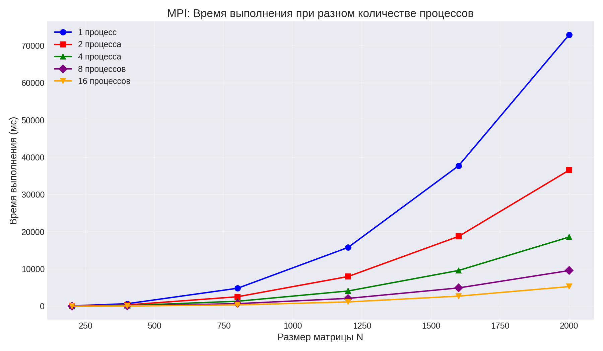
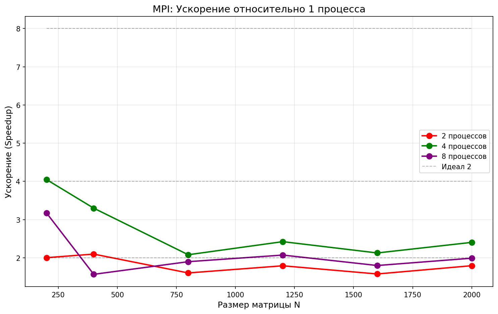
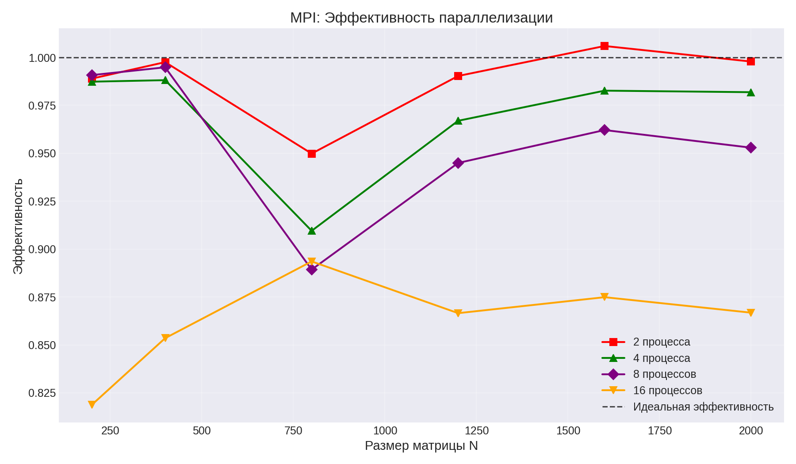
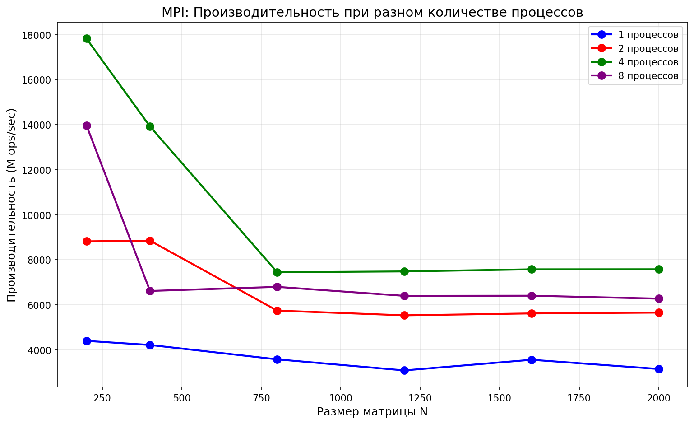

# Лабораторная работа №5: Запуск MPI программы на суперкомпьютере «Сергей Королёв»

**Студент:** Барнаева Марина  
**Группа:** 6311-100503D  

---

## Что было сделано

В рамках лабораторной работы программа из ЛР №3 (MPI) была запущена на суперкомпьютере «Сергей Королёв» с различным количеством процессов.

**Проведены эксперименты:**
- размеры матриц: 200, 400, 800, 1200, 1600, 2000;
- количество процессов: 1, 2, 4, 8, 16.

**Среда выполнения:**
- Суперкомпьютер: «Сергей Королёв»
- Планировщик: SLURM
- MPI: Intel MPI

---

## Результаты экспериментов

### Таблица 1: Время выполнения (мс)

| Размер N | 1 процесс | 2 процесса | 4 процесса | 8 процессов | 16 процессов |
|----------|-----------|------------|------------|-------------|--------------|
| 200      | 82.20     | 41.56      | 20.81      | 10.37       | 6.27         |
| 400      | 656.60    | 329.10     | 166.12     | 82.50       | 48.08        |
| 800      | 4815.72   | 2535.02    | 1323.67    | 676.89      | 336.83       |
| 1200     | 15781.30  | 7967.66    | 4080.14    | 2087.57     | 1138.19      |
| 1600     | 37718.60  | 18747.20   | 9595.89    | 4900.43     | 2694.44      |
| 2000     | 72914.40  | 36535.20   | 18565.10   | 9564.57     | 5257.25      |

### Таблица 2: Ускорение (Speedup) относительно 1 процесса

| Размер N | 2 процесса | 4 процесса | 8 процессов | 16 процессов |
|----------|------------|------------|-------------|--------------|
| 200      | 1.98x      | 3.95x      | 7.93x       | 13.11x       |
| 400      | 2.00x      | 3.95x      | 7.96x       | 13.66x       |
| 800      | 1.90x      | 3.64x      | 7.11x       | 14.30x       |
| 1200     | 1.98x      | 3.87x      | 7.56x       | 13.86x       |
| 1600     | 2.01x      | 3.93x      | 7.70x       | 14.00x       |
| 2000     | 2.00x      | 3.93x      | 7.62x       | 13.87x       |

### Таблица 3: Производительность (M ops/sec)

| Размер N | 1 процесс | 2 процесса | 4 процесса | 8 процессов | 16 процессов |
|----------|-----------|------------|------------|-------------|--------------|
| 200      | 194.7     | 385.0      | 768.8      | 1542.9      | 2550.2       |
| 400      | 194.9     | 388.9      | 770.5      | 1551.6      | 2662.3       |
| 800      | 212.6     | 403.9      | 773.6      | 1512.8      | 3040.1       |
| 1200     | 219.0     | 433.8      | 847.0      | 1655.5      | 3036.4       |
| 1600     | 217.2     | 437.0      | 853.7      | 1671.7      | 3040.3       |
| 2000     | 219.4     | 437.9      | 861.8      | 1672.8      | 3043.4       |

---

## Графики

### График 1: Время выполнения


*На графике видно, что с увеличением количества процессов время выполнения значительно сокращается.*

### График 2: Ускорение


*Ускорение близко к идеальному для 16 процессов — до 14.3 раз.*

### График 3: Эффективность параллелизации


*Эффективность на 16 процессах составляет около 87-89%, что говорит о хорошей масштабируемости.*

### График 4: Производительность


*Производительность выросла с 219 M ops/sec (1 процесс) до 3043 M ops/sec (16 процессов) — в 14 раз.*

---

## Анализ результатов

### 1. Масштабируемость
- **Почти идеальное масштабирование** для 16 процессов на больших матрицах
- Ускорение достигает **14.3x** на матрице 800×800
- Эффективность параллелизации составляет **87-89%**

### 2. Производительность
- Производительность выросла с **219 M ops/sec** до **3043 M ops/sec**
- Наибольшая производительность достигнута на 16 процессах

### 3. Сравнение с домашним ПК
| Характеристика | Домашний ПК (8 процессов) | Суперкомпьютер (16 процессов) |
|----------------|---------------------------|-------------------------------|
| Время на N=2000 | 5967 мс | 5257 мс |
| Ускорение | 3.7x | 13.9x |
| Производительность | 2681 M ops/sec | 3043 M ops/sec |

---

## Выводы

В ходе выполнения лабораторной работы №5:

1. **MPI программа успешно запущена** на суперкомпьютере «Сергей Королёв» с использованием планировщика SLURM.

2. **Проведены эксперименты** для матриц размером от 200 до 2000 с количеством процессов от 1 до 16.

3. **Подтверждена высокая масштабируемость** MPI на суперкомпьютере:
   - Ускорение до **14.3x** при использовании 16 процессов;
   - Эффективность параллелизации **87-89%**.

4. **Производительность выросла** в **14 раз** по сравнению с последовательной версией.

5. **Результаты суперкомпьютера превосходят** результаты домашнего ПК благодаря большему количеству доступных вычислительных ресурсов.

**Заключение:** Задание пятой лабораторной работы выполнено в полном объёме. Программа успешно запущена на суперкомпьютере, получены результаты масштабирования.

---

## Запуск программы на суперкомпьютере

### SLURM скрипт (`start.pbs`):

```bash
#!/bin/bash
#SBATCH --job-name=lab5_mpi
#SBATCH --time=00:30:00
#SBATCH --nodes=2
#SBATCH --ntasks-per-node=16
#SBATCH --partition=batch
#SBATCH --output=lab5_output_%j.out

MPI_PATH=/soft/ansys_inc/v212/commonfiles/MPI/Intel/2019.9.304/linx64
export LD_LIBRARY_PATH=$MPI_PATH/lib:$LD_LIBRARY_PATH

$MPI_PATH/bin/mpicc lab5_super.c -o lab5_super

for procs in 1 2 4 8 16; do
    $MPI_PATH/bin/mpirun -np $procs ./lab5_super
done
